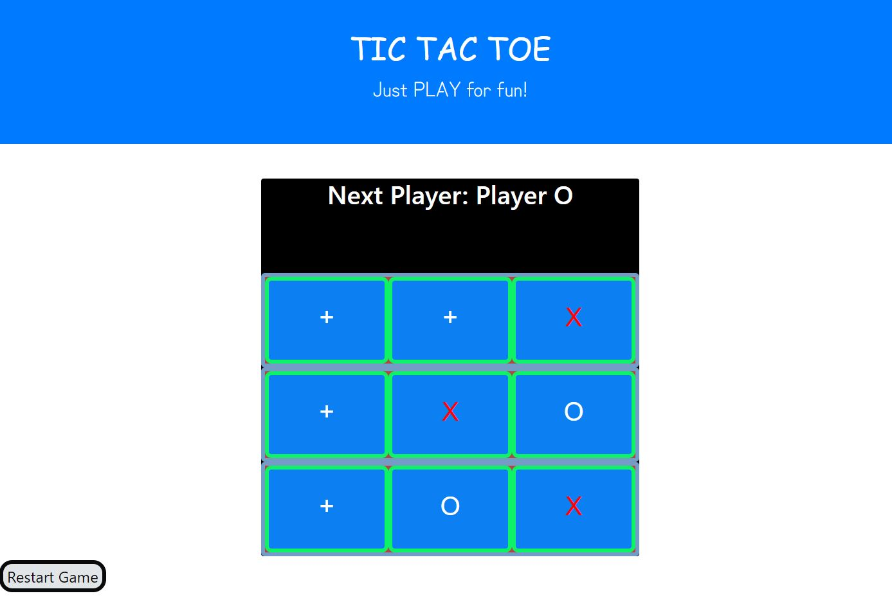

# Name: TicTacToe

## Description: 
TicTacToe is a react program with features like parent/child component interaction, handling style changes, etc. The improvements made to the base version are -
1. Once there is a winner, the cells cannot be modified
2. The text showing the winner will be visible only when there is a win
3. Restart game button will refresh the page

## Installation: 
1. Download the project to your desktop. If zipped, unzip it. 
2. Run 'http-server -c-1' on the command promopt (If you do not have http setup, use npm i http-server to install it.)
3. Open standalone.html file in a browser by navigating to the location using the URL http://localhost:8080/ to track your todo list. 

## Usage: 
Use this project to play with React features like css property modification, parent/child component interaction etc.

## Support: 
There are many support portals available for React & JavaScript like MDN, StackOverflow, etc. You can use this forum to research various styles and ask questions.

## Roadmap: 
The future enhancements for this project will be -
1. Declare a tie when there are no winners
2. Keep track of wins/loss for each player and provide them opportunity to play multiple times
3. Change the cell colors of unfilled squares on win 

## License information: 

See MIT license release in repository.